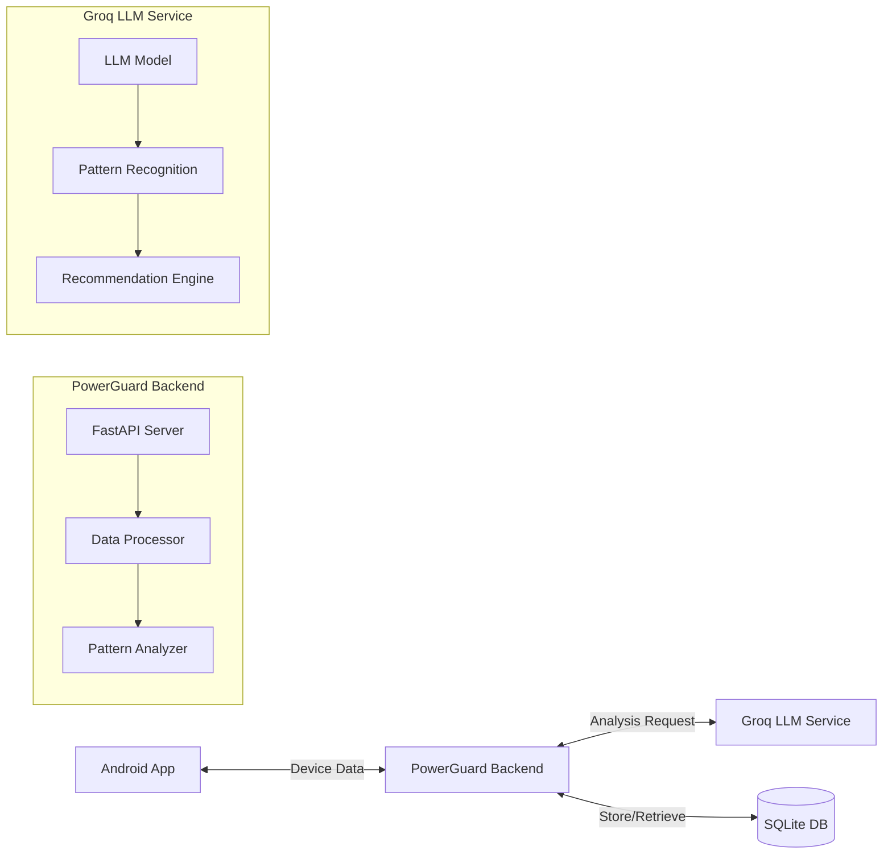

# PowerGuard: AI-Powered Battery & Network Optimization System

## Project Overview

PowerGuard is an innovative AI-powered system designed to optimize battery and network usage on mobile devices. Unlike traditional hardcoded optimization strategies, PowerGuard uses machine learning to analyze usage patterns and provide personalized recommendations for resource management.

### Key Differentiators

1. **AI-Powered Pattern Recognition**: Advanced algorithms for identifying usage patterns
2. **Personalized Recommendations**: Tailored suggestions based on individual usage
3. **Scalable Architecture**: Built for handling millions of devices
4. **Real-Time Analysis**: Immediate insights and recommendations
5. **Cross-Platform Support**: Works across different device types and manufacturers
6. **Smart Resource Management**: Intelligent app optimization while preserving critical services
7. **Comprehensive Optimization**: Addresses both battery and network consumption

## Problem Statement

Mobile devices face two critical resource limitations:
- Battery drain
- Network data consumption

Current solutions follow a rigid, one-size-fits-all approach that fails to account for individual user needs and habits. PowerGuard addresses this by providing:

- AI-driven intelligent decisions based on actual usage patterns
- Complete transparency into resource consumption
- Granular user control over resource allocation
- Smart trade-offs based on learned behavior

## Technical Architecture

### System Components



### API Endpoints

- `POST /api/analyze` - Analyze device data and get optimization recommendations
- `GET /api/patterns/{device_id}` - Get usage patterns for a specific device
- `POST /api/reset-db` - Reset the database (admin only)
- `GET /api/all-entries` - Get all database entries

### Rate Limits

- Default endpoints: 100 requests/minute
- Analyze endpoint: 30 requests/minute
- Patterns endpoint: 60 requests/minute
- Reset DB endpoint: 5 requests/hour

## Features

### Core Functionality
- Usage pattern analysis
- Personalized recommendations
- Multi-device support
- Historical data tracking
- Network usage optimization
- Storage optimization

### User-Centric Design
- Easy-to-understand patterns
- Clear actionable insights
- User consent controls
- Transparent app management
- Customizable power saving modes
- Network optimization toggles

## Technical Implementation

### Database Schema
```sql
CREATE TABLE usage_patterns (
    id INTEGER PRIMARY KEY,
    device_id TEXT NOT NULL,
    package_name TEXT NOT NULL,
    pattern TEXT NOT NULL,
    timestamp INTEGER NOT NULL,
    UNIQUE(device_id, package_name)
);
```

### Setup Instructions

1. Clone the repository
2. Create a virtual environment:
   ```bash
   python -m venv venv
   source venv/bin/activate  # On Windows: venv\Scripts\activate
   ```
3. Install dependencies:
   ```bash
   pip install -r requirements.txt
   ```
4. Set up environment variables:
   ```
   GROQ_API_KEY=your_api_key_here
   ```
5. Run the application:
   ```bash
   python run.py
   ```

### Development Requirements
- Python 3.9+
- FastAPI
- SQLAlchemy
- Groq LLM API
- SQLite

## Documentation

Interactive API documentation available at:
- Swagger UI: `/docs`
- ReDoc: `/redoc`

## License

MIT License 