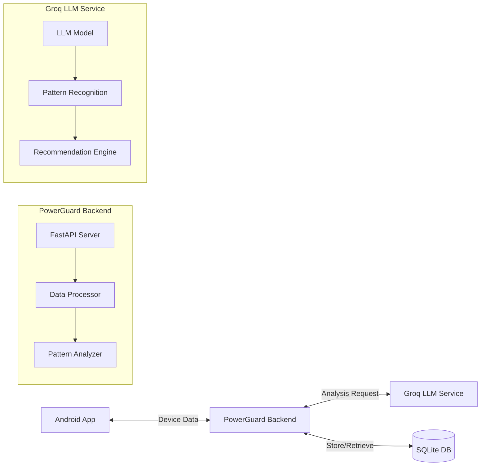

# PowerGuard: AI-Powered Battery & Network Optimization System

## Project Overview

PowerGuard is an innovative AI-powered system designed to optimize battery and network usage on
mobile devices. Unlike traditional hardcoded optimization strategies, PowerGuard uses machine
learning to analyze usage patterns and provide personalized recommendations for resource management.

### Key Differentiators

1. **AI-Powered Pattern Recognition**: Advanced algorithms for identifying usage patterns
2. **Personalized Recommendations**: Tailored suggestions based on individual usage
3. **Scalable Architecture**: Built for handling millions of devices
4. **Real-Time Analysis**: Immediate insights and recommendations
5. **Cross-Platform Support**: Works across different device types and manufacturers
6. **Smart Resource Management**: Intelligent app optimization while preserving critical services
7. **Comprehensive Optimization**: Addresses both battery and network consumption

## Problem Statement

Mobile devices face two critical resource limitations:

- Battery drain
- Network data consumption

Current solutions follow a rigid, one-size-fits-all approach that fails to account for individual
user needs and habits. PowerGuard addresses this by providing:

- AI-driven intelligent decisions based on actual usage patterns
- Complete transparency into resource consumption
- Granular user control over resource allocation
- Smart trade-offs based on learned behavior

## System App Requirements

**Important Note:** PowerGuard is designed to run as a system app to access the necessary
permissions for deep optimization. This requires:

1. A rooted device, or
2. An Android emulator with system privileges, or
3. Integration into a custom ROM

For installation instructions, please see [SYSTEM_APP_INSTALLATION.md](SYSTEM_APP_INSTALLATION.md).

### Installation Location

PowerGuard is installed as a privileged system app in `/system/priv-app` to maximize permission
access. This location grants the app more automatic permissions compared to the standard
`/system/app` location.

After installation, you must run the provided permissions script to handle permissions that require
special granting:

```bash
# Make the script executable
chmod +x grant_permissions.sh

# Run the script to grant permissions
./grant_permissions.sh
```

### Permission Handling

When installed in `/system/priv-app`, most system permissions are granted automatically, but some
still require special handling:

1. **Automatic Permissions** (granted by `priv-app` status):
    - `BATTERY_STATS`
    - `WRITE_SECURE_SETTINGS`
    - `READ_LOGS`

2. **Special Permissions** (handled by `grant_permissions.sh`):
    - `PACKAGE_USAGE_STATS`: Granted via AppOps using `appops set`

3. **Manual Permissions** (require user interaction):
    - `WRITE_SETTINGS`: Must be enabled in Settings → Apps → Special app access → Modify system
      settings

4. **Restricted Permissions** (non-changeable):
    - `MANAGE_NETWORK_POLICY`: Reserved for platform components and cannot be granted via normal
      means
    - `FORCE_STOP_PACKAGES`: Reserved for platform components and cannot be granted via normal means
    - `DEVICE_POWER`: Managed by role and cannot be granted via normal means

PowerGuard includes adaptive logic to handle cases where certain permissions aren't available,
providing fallback behaviors and recommendations when direct system actions cannot be performed.

## Technical Architecture

### System Components



### API Endpoints

- `POST /api/analyze` - Analyze device data and get optimization recommendations
- `GET /api/patterns/{device_id}` - Get usage patterns for a specific device
- `POST /api/reset-db` - Reset the database (admin only)
- `GET /api/all-entries` - Get all database entries

### Rate Limits

- Default endpoints: 100 requests/minute
- Analyze endpoint: 30 requests/minute
- Patterns endpoint: 60 requests/minute
- Reset DB endpoint: 5 requests/hour

## Features

### Core Functionality

- Usage pattern analysis
- Personalized recommendations
- Multi-device support
- Historical data tracking
- Network usage optimization
- Storage optimization

### User-Centric Design

- Easy-to-understand patterns
- Clear actionable insights
- User consent controls
- Transparent app management
- Customizable power saving modes
- Network optimization toggles

## System-level Capabilities

As a privileged system app, PowerGuard can perform the following optimizations:

1. **Force stop battery-draining apps** - When battery is critically low, automatically identify and
   stop non-essential apps
2. **Restrict background data** - Limit network usage for apps that consume excessive data in the
   background
3. **Manage wakelocks** - Prevent apps from keeping the device awake unnecessarily
4. **Control sync frequency** - Optimize how often apps sync with servers
5. **Smart charging control** - Notify users when to stop charging to preserve battery health
6. **App background restrictions** - Apply different restriction levels based on usage patterns

The app includes fallback behaviors for cases where specific permissions aren't available, ensuring
it remains useful even with limited access.

## Technical Implementation

### Database Schema

```sql
CREATE TABLE usage_patterns (
    id INTEGER PRIMARY KEY,
    device_id TEXT NOT NULL,
    package_name TEXT NOT NULL,
    pattern TEXT NOT NULL,
    timestamp INTEGER NOT NULL,
    UNIQUE(device_id, package_name)
);
```

### Setup Instructions

1. Clone the repository
2. Create a virtual environment:
   ```bash
   python -m venv venv
   source venv/bin/activate  # On Windows: venv\Scripts\activate
   ```
3. Install dependencies:
   ```bash
   pip install -r requirements.txt
   ```
4. Set up environment variables:
   ```
   GROQ_API_KEY=your_api_key_here
   ```
5. Run the application:
   ```bash
   python run.py
   ```

### Development Requirements

- Python 3.9+
- FastAPI
- SQLAlchemy
- Groq LLM API
- SQLite

## Documentation

Interactive API documentation available at:

- Swagger UI: `/docs`
- ReDoc: `/redoc`

- **[SYSTEM_APP_INSTALLATION.md](SYSTEM_APP_INSTALLATION.md)**: Detailed instructions for installing
  PowerGuard as a system app.
- **[PERMISSION_STATUS.md](PERMISSION_STATUS.md)**: Current status of system permissions and
  implementation details.
- **[SYSTEM_APP_CHANGES.md](SYSTEM_APP_CHANGES.md)**: Changes made to adapt PowerGuard for
  installation in `/system/app` instead of `/system/priv-app`.
- **[NEXT_STEPS.md](NEXT_STEPS.md)**: Planned enhancements and next steps for PowerGuard.
- **[DATA_SAVER_INSTRUCTIONS.md](DATA_SAVER_INSTRUCTIONS.md)**: Guide for configuring Data Saver to
  work optimally with PowerGuard's network optimization features in API 35
- **[SYSTEM_ARCHITECTURE.md](SYSTEM_ARCHITECTURE.md)**: Comprehensive high-level and low-level
  design documentation of PowerGuard's architecture and functionality

## API Compatibility

PowerGuard is designed to work with Android API 24 and above, with adaptive optimization strategies:

- Core functionality works consistently across all supported API levels
- Optimization strategies intelligently adapt to the permissions and features available
- User guidance is provided when manual configuration steps are needed

See [DATA_SAVER_INSTRUCTIONS.md](DATA_SAVER_INSTRUCTIONS.md) for information on configuring network
optimization features.

## API Integration

The app integrates with a backend API that provides intelligent analysis of device data and
actionable recommendations. The API contract is documented in
`app/src/main/java/com/hackathon/powergaurd/docs/APIContract.md`.

### Key Integration Points

1. **Data Collection**: The app collects device metrics at regular intervals and during significant
   events.
2. **Data Analysis**: Collected data is sent to the backend for AI-powered analysis.
3. **Actionable Insights**: The backend returns actionable recommendations that can be automatically
   implemented.
4. **Performance Metrics**: The API provides scoring for battery life, data usage, and device
   performance.

## Architecture

PowerGuard follows a modern Android architecture:

- **MVVM Pattern**: Clear separation of UI, business logic, and data.
- **Dependency Injection**: Uses Hilt for dependency management.
- **Coroutines**: Handles asynchronous operations efficiently.
- **WorkManager**: Manages background tasks for data collection and optimization.
- **Room Database**: Stores history of optimizations and actions.
- **Jetpack Compose**: Powers the modern UI components.

## Getting Started

1. Clone the repository
2. Open the project in Android Studio
3. Configure your backend API endpoint in `network/ApiConfig.kt`
4. Build and run on your device or emulator

## Project Structure

- **ui**: UI components and screens
- **worker**: Background processing components
- **data**: Data models and repositories
- **network**: API client and network helpers
- **actionable**: Actionable handlers and executors
- **collector**: Device data collectors
- **di**: Dependency injection modules
- **widget**: Home screen widget implementation
- **docs**: API and implementation documentation

## Backend Integration

To connect to your own backend:

1. Implement the API contract defined in `docs/APIContract.md`
2. Replace the `MockApiService` with a real implementation in `di/NetworkModule.kt`
3. Configure your endpoint URL in `network/ApiConfig.kt`

## License

MIT License 