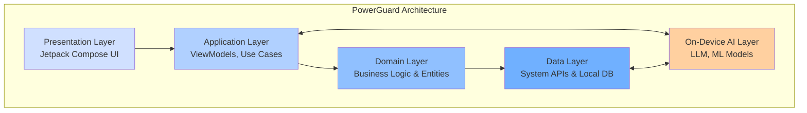
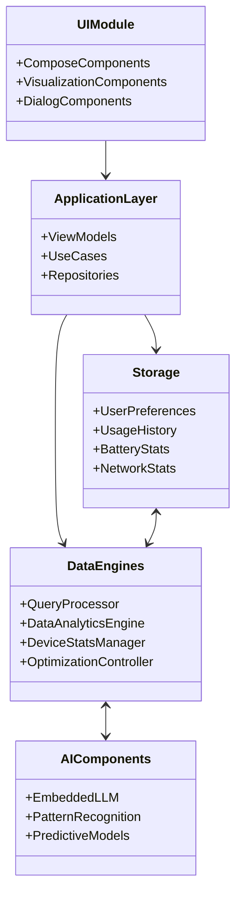
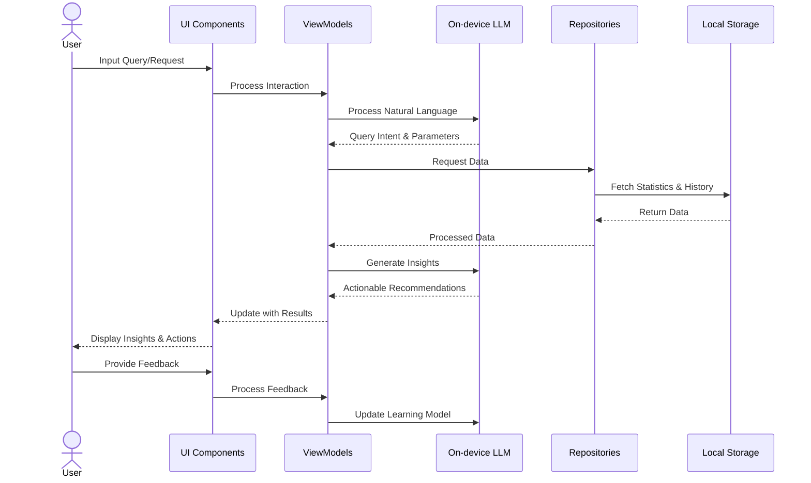

# PowerGaurd App Presentation

## 1. What problem does the app solve?

PowerGaurd addresses the critical issues of battery drain and excessive data consumption on mobile devices. Modern smartphones face rapid battery depletion and unexpected data usage, which leads to:
- Interrupted productivity
- Anxiety about battery life during important events
- Unexpected data overages and charges
- Reduced device longevity

PowerGaurd provides an intelligent solution that optimizes battery and data usage based on user patterns and preferences, ensuring users never run out of power or data when they need it most.

## 2. Features of the app

### Smart Assistant Interface
- Natural language processing for conversational queries
- Personalized recommendations based on usage patterns
- Context-aware responses to user questions

### Information Analysis
- Real-time identification of high battery/data consuming apps
- Detailed usage statistics and visualization
- Historical usage pattern analysis

### Predictive Capabilities
- Battery life forecasting for specific activities
- Data consumption projections
- Personalized usage recommendations

### Optimization Tools
- Custom battery saving profiles for different scenarios
- Selective app prioritization (keep essential apps running)
- Intelligent background process management

### Monitoring and Alerts
- Customizable threshold notifications
- Context-based alerts (e.g., battery warnings during gaming)
- Proactive suggestions to prevent depletion

### Usage Pattern Recognition
- Learning algorithm adapts to user behavior
- Continuously improving recommendations
- Seasonal and situational adaptive profiles

## 3. Technicalities of the app

### Architecture
- Modern Android application built with Kotlin
- MVVM (Model-View-ViewModel) architecture
- Jetpack Compose for UI components
- Material 3 design implementation

### Key Technologies
- Kotlin Coroutines for asynchronous operations
- Jetpack Compose for declarative UI
- Android Battery and Network Stats APIs
- On-device Machine Learning for usage pattern recognition
- On-device Natural Language Processing for query interpretation

### On-Device Processing
- Embedded LLM for query processing (no cloud connectivity required)
- Local storage for usage history and patterns
- On-device ML models for all intelligent features
- Privacy-focused design with all data staying on user's device

### Performance Considerations
- Minimal battery usage while monitoring
- Efficient background processing
- Low memory footprint
- Fast response time for queries

## 4. User Journey with On-Device LLM Integration

### User Journey Flow
1. **Query Input**
   - User asks a natural language question
   - Interface captures and formats the query

2. **Intent Recognition**
   - On-device LLM classifies the query intention
   - System determines if it's informational, predictive, or action-oriented

3. **Data Processing**
   - System retrieves relevant device statistics
   - Combines with historical usage patterns stored locally
   - On-device LLM contextualizes raw data with user preferences

4. **Response Generation**
   - Local LLM formulates a personalized, relevant answer
   - Creates actionable insights based on available options

5. **Action Execution**
   - User selects recommended actions
   - System applies optimizations or configurations
   - Confirmation feedback provided to user

```
┌───────────────┐     ┌──────────────────┐     ┌───────────────────┐
│  User Query   │────▶│  Intent Analysis │────▶│   Data Retrieval  │
└───────────────┘     │  (On-device LLM) │     │   (Local Data)    │
                      └──────────────────┘     └─────────┬─────────┘
                                                         │
                                                         ▼
┌───────────────┐     ┌──────────────────┐     ┌───────────────────┐
│   Feedback    │◀────│  Action Execution│◀────│ Response Generation│
│     Loop      │     │                  │     │  (On-device LLM)   │
└───────────────┘     └──────────────────┘     └───────────────────┘
```

### On-Device LLM Functions
- **Query Processing**: Understands natural language requests locally
- **Context Building**: Combines user history, device state, and query intent
- **Insight Generation**: Transforms raw data into actionable information
- **Response Personalization**: Tailors suggestions to user preferences
- **Continuous Learning**: Improves recommendations based on user feedback

## 5. High-Level and Low-Level Design

### High-Level Design



- **Presentation Layer**: Jetpack Compose UI components
- **Application Layer**: ViewModels, Use Cases, and Repositories
- **Domain Layer**: Business Logic and Entity Models
- **Data Layer**: System APIs and Local Database
- **On-Device AI Layer**: Query Processing and Response Generation

### Low-Level Design Components



### Data Flow



1. User interaction captured by UI components
2. ViewModels process interactions and query on-device LLM
3. Repositories fetch device statistics and historical data from local storage
4. Domain logic applies optimization algorithms
5. Results propagated back through ViewModel
6. UI updated with actionable insights
7. User feedback incorporated into local learning system 